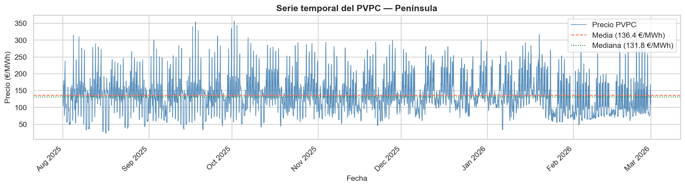
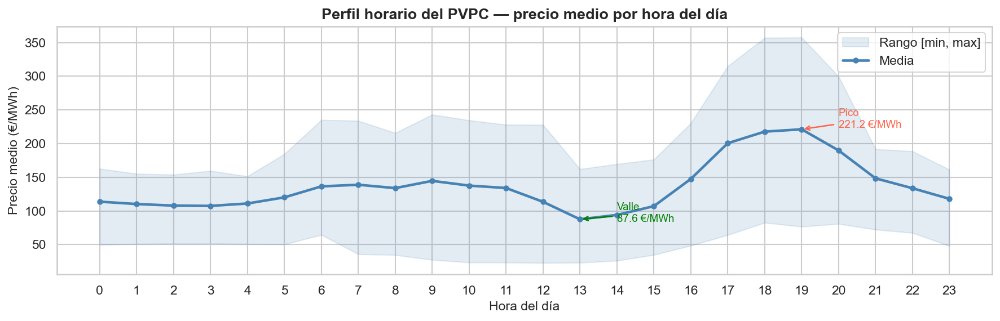
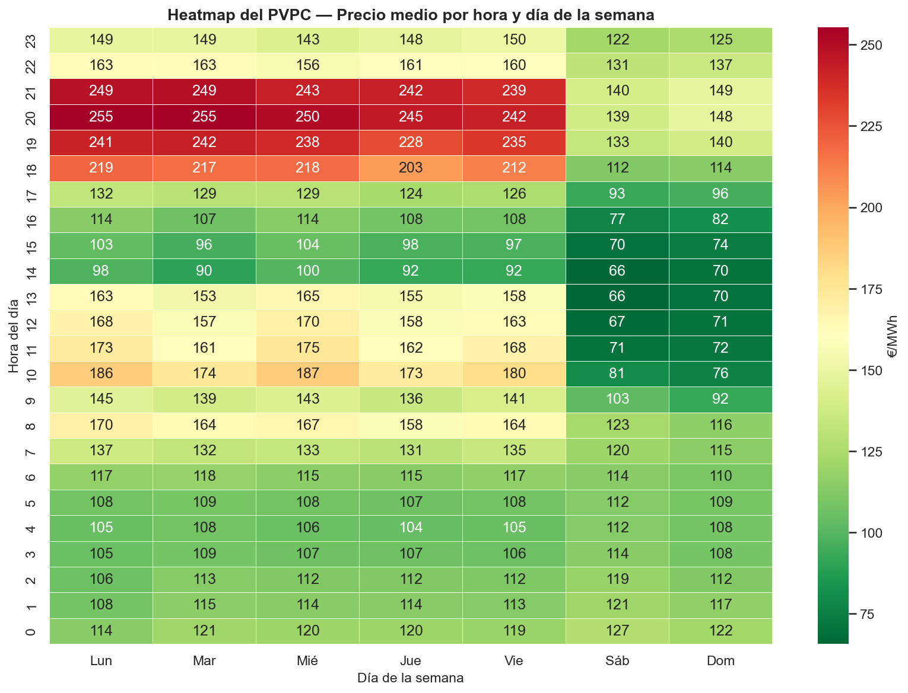
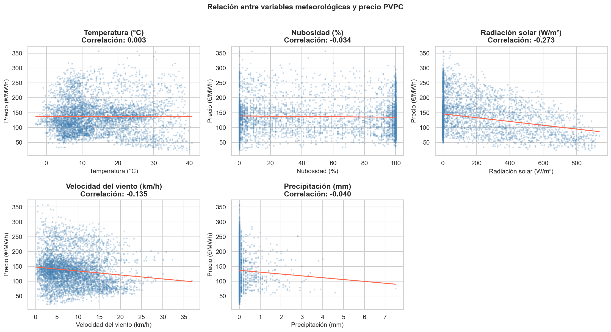
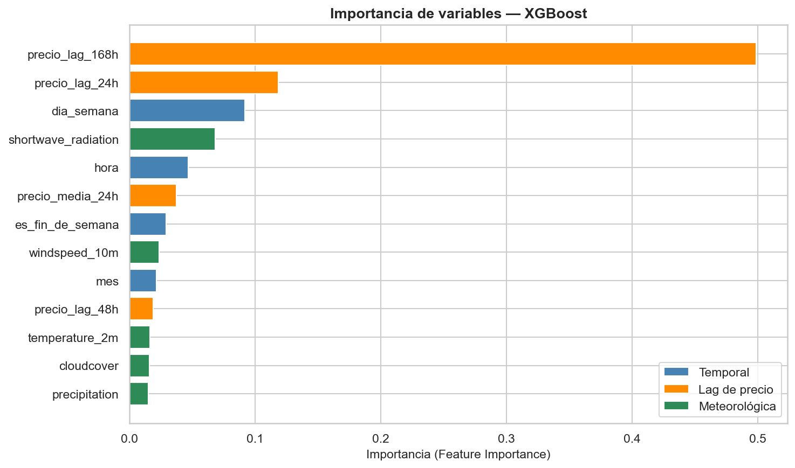
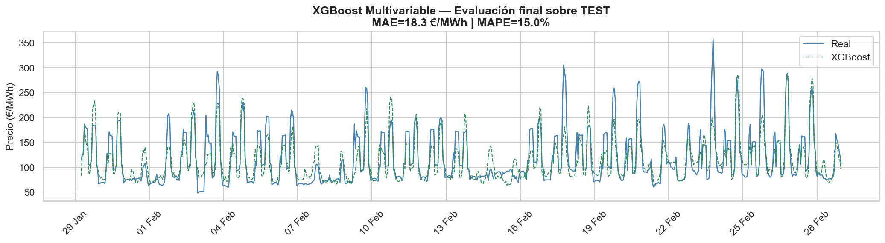

# ⚡ PVPC Forecast — Predicción del Precio de la Electricidad en España

Pipeline de ciencia de datos **end-to-end** para la predicción horaria del
**Precio Voluntario para el Pequeño Consumidor (PVPC)** en España,
usando datos en tiempo real de la API de [ESIOS — Red Eléctrica de España](https://www.esios.ree.es/es/pagina/api)
y meteorología horaria de [Open-Meteo](https://open-meteo.com).

Cada mañana a las **6:00 UTC**, GitHub Actions descarga datos frescos,
reentrena el modelo y envía un correo con la predicción del día.

---

## 🎯 Resultados

| Modelo | MAE (€/MWh) | RMSE (€/MWh) | MAPE | Datos |
|--------|:-----------:|:------------:|:----:|-------|
| **XGBoost Multivariable** ✅ | **18.27** | **26.54** | **15.04%** | Precio + meteorología |
| Prophet | 36.15 | 42.61 | 38.55% | Solo precio |
| Naive Seasonal | — | — | ~34% | Solo precio |
| SARIMA(1,1,1)(1,1,1,24) | — | — | ~51% | Solo precio |

> Evaluación sobre conjunto de **test** (enero–febrero 2026, 738 horas).
> XGBoost mejora el MAPE un **61%** sobre Prophet al incorporar variables meteorológicas.

---

## 📊 Visualizaciones

**Serie temporal completa del PVPC (agosto 2025 – febrero 2026)**


**Perfil horario — precio medio por hora del día**


**Heatmap hora × día de la semana**


**Correlación precio vs variables meteorológicas**


**Importancia de variables — XGBoost**


**Predicción final XGBoost sobre conjunto de test**


---

## 🏗️ Arquitectura del proyecto

```
pvpc-forecast/
│
├── predict.py                      ← Predicción en producción (punto de entrada)
│
├── src/
│   ├── data/
│   │   ├── fetch_data.py           ← Descarga PVPC de la API ESIOS
│   │   ├── fetch_weather.py        ← Descarga meteorología de Open-Meteo
│   │   └── process_data.py         ← Limpieza, fusión y feature engineering
│   ├── models/
│   │   └── train_models.py         ← Naive, SARIMA, Prophet y XGBoost
│   └── notifications/
│       └── send_email.py           ← Envío de correo con la predicción diaria
│
├── notebooks/
│   ├── 01_eda_pvpc.ipynb           ← Análisis exploratorio y visualizaciones
│   ├── 02_modeling_pvpc.ipynb      ← Modelos univariables (Naive, SARIMA, Prophet)
│   └── 03_modeling_multivariate.ipynb  ← XGBoost multivariable con meteorología
│
├── .github/
│   └── workflows/
│       └── daily_forecast.yml      ← GitHub Actions: ejecución diaria automática
│
├── data/
│   ├── raw/            ← JSON originales de las APIs (no versionados)
│   ├── processed/      ← CSV limpios y datasets multivariables (no versionados)
│   └── predictions/    ← Predicciones generadas (no versionadas)
│
├── docs/images/        ← Gráficos del análisis (versionados)
├── .env.example        ← Plantilla de credenciales
├── requirements.txt    ← Dependencias de producción
└── requirements-dev.txt ← Dependencias adicionales para desarrollo local
```

---

## 🚀 Cómo usar este proyecto

### 1. Clona el repositorio
```bash
git clone https://github.com/TU_USUARIO/pvpc-forecast.git
cd pvpc-forecast
```

### 2. Crea el entorno virtual e instala dependencias
```bash
python -m venv .venv

# Windows
.venv\Scripts\activate
# macOS / Linux
source .venv/bin/activate

# Producción (solo lo necesario para predecir)
pip install -r requirements.txt

# Desarrollo (incluye Jupyter, Prophet, etc.)
pip install -r requirements-dev.txt
```

### 3. Configura tus credenciales
```bash
cp .env.example .env
# Edita .env con tu token de ESIOS y credenciales de Gmail
```

### 4. Predice el precio de las próximas 24 horas
```bash
python predict.py
```

### 5. Predice y envía el correo
```bash
python predict.py --email
```

Salida de ejemplo:
```
====================================================================
  PREDICCIÓN PVPC — PRÓXIMAS HORAS (Península) · XGBoost
====================================================================
  Hora local (CET/CEST)      Precio (€/MWh)           Intervalo
--------------------------------------------------------------------
  2026-03-02 04:00                   47.21        [40 – 54]  ▼ más barato
  ...
  2026-03-02 20:00                  214.38       [182 – 246]  ▲ más caro
====================================================================
  Media predicha:  108.34 €/MWh
```

### 6. Explora los notebooks
```bash
jupyter notebook
```

---

## ⚙️ Automatización con GitHub Actions

El workflow `daily_forecast.yml` se ejecuta **cada día a las 6:00 UTC** de forma completamente autónoma:

```
⏰ Cron 6:00 UTC
    ↓
📡 Descarga precio PVPC (API ESIOS)
    ↓
🌤️ Descarga meteorología (Open-Meteo)
    ↓
🤖 Reentrena XGBoost (últimos 60 días)
    ↓
📧 Envía correo HTML con predicción
    ↓
📁 Guarda CSV como artefacto (7 días)
```

**Secrets necesarios en GitHub** (`Settings → Secrets → Actions`):

| Secret | Descripción |
|--------|-------------|
| `ESIOS_TOKEN` | Token personal de la API de ESIOS |
| `GMAIL_SENDER` | Dirección Gmail del bot remitente |
| `GMAIL_APP_PASS` | Contraseña de aplicación de Gmail (16 caracteres) |
| `EMAIL_RECIPIENTS` | Destinatarios separados por comas |

---

## 🗺️ Fases del proyecto

| Fase | Descripción | Estado |
|------|-------------|:------:|
| 1 | Conexión a la API ESIOS y descarga automatizada de datos | ✅ |
| 2 | Limpieza de datos, EDA y visualizaciones | ✅ |
| 3 | Modelado univariable: Naive Seasonal, SARIMA y Prophet | ✅ |
| 4 | Script de predicción en producción y documentación | ✅ |
| 5a | Integración de datos meteorológicos (Open-Meteo) | ✅ |
| 5b | Modelo multivariable XGBoost con feature engineering | ✅ |
| 5c | GitHub Actions: automatización diaria | ✅ |
| 5d | Notificaciones por email (Gmail SMTP) | ✅ |

---

## 🔍 Hallazgos principales

**EDA:** El PVPC presenta un doble pico diario (matutino 7-8h industrial, vespertino 19-21h doméstico) con valle al mediodía por la producción solar fotovoltaica. Los fines de semana son ~30% más baratos que los laborables.

**Feature importance (XGBoost):**
- `precio_lag_168h` (precio de la semana pasada a la misma hora): **49.8%** — el patrón semanal domina
- `precio_lag_24h` (precio de ayer a la misma hora): **11.9%**
- `shortwave_radiation` (radiación solar): **6.8%** — la variable meteorológica más relevante
- `windspeed_10m` (viento), `temperature_2m` (temperatura): contribución menor pero significativa

---

## 🛠️ Tecnologías

| Categoría | Librerías |
|-----------|-----------|
| Ingesta de datos | `requests`, `python-dotenv` |
| Procesamiento | `pandas`, `numpy` |
| Visualización | `matplotlib`, `seaborn` |
| Modelado | `statsmodels` (SARIMA), `prophet`, `xgboost` |
| Evaluación | `scikit-learn` |
| Automatización | GitHub Actions, Gmail SMTP |

**Python 3.11+**

---

## 📚 Referencias

- [Documentación API ESIOS](https://www.esios.ree.es/es/pagina/api)
- [Indicador PVPC (ID: 1001)](https://www.esios.ree.es/es/pvpc)
- [Open-Meteo API](https://open-meteo.com/en/docs/historical-weather-api)
- [XGBoost Documentation](https://xgboost.readthedocs.io)
- [Forecasting: Principles and Practice — Hyndman & Athanasopoulos](https://otexts.com/fpp3/)

---

## 👤 Autor

Proyecto de aprendizaje personal — Grado en Ciencia de Datos.
Desarrollado como ejercicio de construcción de un pipeline de datos completo,
desde la ingesta de datos en crudo hasta la predicción automatizada en producción.
